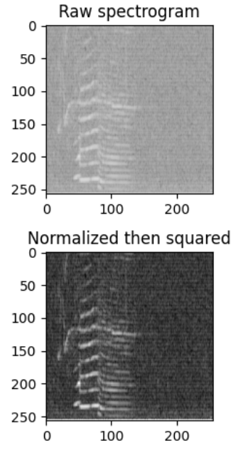

# Routines to read wav audio data
### Extract audio data
### Calculate power spectral density
###     Integrate into selected frequency bands
### Append psd slices to form Spectrogram
### Transform Spectrogram as desired

